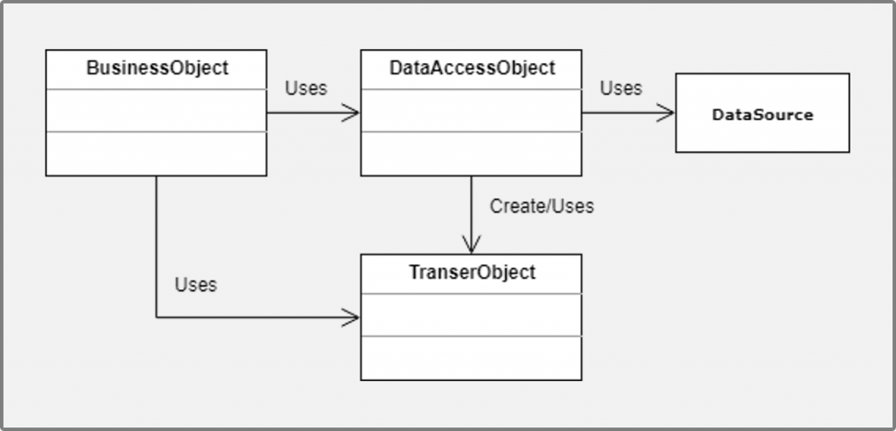

# Blog-Relacional-AccesoDatos-2021-2022
Ejemplo de desarrollo de un blog (backend básico) para Acceso a Datos, usando una base de datos realacional e implementando distintas técnicas y patrones de Acceso a Datos vistos en clase.

[](https://www.java.com/es/)
[]()


- [Blog-Relacional-AccesoDatos-2021-2022](#blog-relacional-accesodatos-2021-2022)
  - [Descripción](#descripción)
  - [Tecnologías](#tecnologías)
  - [Enunciado](#enunciado)
    - [Ejemplo de diagrama](#ejemplo-de-diagrama)
  - [Desarrollo](#desarrollo)
    - [GitFlow](#gitflow)
    - [Maven](#maven)
    - [Secretos](#secretos)
    - [Lombok](#lombok)
  - [Arquitectura](#arquitectura)
    - [Patrón DAO](#patrón-dao)
    - [Controladores - Servicios - Repositorios](#controladores---servicios---repositorios)
      - [Controlador](#controlador)
      - [Servicio](#servicio)
      - [Repositorio](#repositorio)
      - [Repositorio vs DAO](#repositorio-vs-dao)
  - [Ejecución](#ejecución)
    - [Docker](#docker)
    - [Adminer o cliente de Bases de Datos](#adminer-o-cliente-de-bases-de-datos)
  - [Autor](#autor)
    - [Contacto](#contacto)
  - [Licencia](#licencia)

## Descripción
Se ha implementado el desarrollo del un blog a nivel de backend para el acceso a los datos que se necesiten con fines didácticos para el módulo de Acceso a Datos de 2DAM.
Debes entender que es un ejemplo didáctico para clase, por lo que parte de la solución simplemente es para mostrar distintas técnicas y patrones y por lo tanto 
puede que no sea la más óptima o adecuada a niveles de producción o empresarial. Tenlo en cuenta.

## Tecnologías
Se han usado las siguientes tecnologías:
- Java 11, como lenguaje de programación.
- MariaDB como motor de base de datos relacional.
- Docker para lanzar la base de datos, así como otras utilidades para manejarla.

## Enunciado
Se desea implementar la base de un blog teniendo en cuenta que: 
- Un usuario una vez registrado mediante email y password puede hacer login y logout en el sistema.
- El usuario puede escribir varios posts los cuales pertenecen solo a una categoría existente, como general, dudas o evaluación. Se pueden crear nuevas categorías.
- Los usuarios pueden hacer distintos comentarios sobre posts existentes.

### Ejemplo de diagrama


## Desarrollo
### GitFlow
Se ha usado GitFlow como modelo de flujo de desarrollo y trabajo con el repositorio.

### Maven
Apache Maven es un software de gestión de proyectos. Maven aumenta la reutilización y también se encarga de la mayoría 
de las tareas relacionadas con la construcción. Funciona en muchos pasos, como agregar archivos jar a la biblioteca del proyecto, 
crear informes y ejecutar casos de prueba o crear archivos Jar para el proyecto e incluso muchas más cosas.
La configuración de Maven se guarda en el fichero [pom.xml](./pom.xml).

### Secretos
Para trabajar con secretos y o variables globales se han usado dos enfoques en el directorio recursos:
- Ficheros de Properties (Propiedades): con ellos podemos leer propiedades de la manea clave valor.
- Ficheros .env: Mediante ellos leemos las variables de entorno ya sea del sistema o definidas en un fichero .env 

### Lombok
Se ha usado [Lombok](https://projectlombok.org/features/all) como sistema de anotaciones para aumentar la productividad 
y reducir el código repetitivo.

## Arquitectura
### Patrón DAO
Debemos tener en cuenta que la implementación y formato de la información puede variar según la fuente de los datos el patrón DAO propone separar por completo la lógica de negocio de la lógica para acceder a los datos, de esta forma, el DAO proporcionará los métodos necesarios para insertar, actualizar, borrar y consultar la información; por otra parte, la capa de negocio solo se preocupa por lógica de negocio y utiliza el DAO para interactuar con la fuente de datos.


### Controladores - Servicios - Repositorios
La arquitectura que seguiremos es tipo CSS (Controladores -> Servicios -> Repositorios) de esta manera cualquier cambio no afectaría a la capa superior, manteniendo nuestra compatibilidad si por ejemplo pasamos de almacenamiento en ficheros XML a bases de datos relacionales o no relacionales.


#### Controlador 
Tiene la lógica de la aplicación y controla y redirige las distintas peticiones que se nos hacen.

#### Servicio
Tienen la lógica de negocio y procesan las peticiones que se nos hacen accediendo a los recursos necesarios para ello usando los repositorios. Son la capa intermedia.

#### Repositorio
Implementan la lógica de acceso y manipulación de los datos encapsulando dichas operaciones.

#### Repositorio vs DAO
- DAO implementa las operaciones a más bajo nivel para persistencia y manipulación de la información. DAO es una abstracción de la persistencia de datos. DAO es un concepto de nivel inferior, más cercano a los sistemas de almacenamiento de datos. DAO funciona como una capa de mapeo/acceso de datos.
- Repositorio encapsula el propio sistema de almacenamiento, pero no suele estar tan ligado a dicho sistema de almacenamiento. Un repositorio es una abstracción de una colección de objetos. El el repositorio es un concepto de nivel superior, más cercano a los objetos de dominio. un repositorio es una capa entre dominios y capas de acceso a datos, que oculta la complejidad de recopilar datos y preparar un objeto de dominio.
- Se puede dar el caso que un mismo repositorio trabaje con distintos DAOS, por ejemplo las operaciones de manejo de datos de usuarios estén en una base de datos relacional (login, password) y en una NoSQL otra información (nombre, apellidos, email, etc). Es por ello que el repositorio para manejo de usuario llamará por debajo a dos DAOS separados. Pero si la correspondencia es 1 a 1, las ideas son muy similares y podemos optar por uno de ellos.

## Ejecución
### Docker
Entrar en el directorio docker y ejecutar
```sh
$ docker-compose up -d
```
Para iniciar la BD con algunos datos modifica el fichero [docker/mariadb/sql/init.sql](docker/mariadb/sql/init-db.sql)


### Adminer o cliente de Bases de Datos
Debes conectarte a http://localhost:8080/
- server: mariadb
- user: blog
- password: blog1234 
- base de datos blog

## Autor

Codificado con :sparkling_heart: por [José Luis González Sánchez](https://twitter.com/joseluisgonsan)

[](https://twitter.com/joseluisgonsan)
[](https://github.com/joseluisgs)

### Contacto
<p>
  Cualquier cosa que necesites házmelo saber por si puedo ayudarte 💬.
</p>
<p>
    <a href="https://twitter.com/joseluisgonsan" target="_blank">
        
    </a> &nbsp;&nbsp;
    <a href="https://github.com/joseluisgs" target="_blank">
        
    </a> &nbsp;&nbsp;
    <a href="https://www.linkedin.com/in/joseluisgonsan" target="_blank">
        
    </a>  &nbsp;&nbsp;
    <a href="https://joseluisgs.github.io/" target="_blank">
        
    </a>
</p>


## Licencia

Este proyecto está licenciado bajo licencia **MIT**, si desea saber más, visite el fichero [LICENSE](./LICENSE) para su uso docente y educativo.
